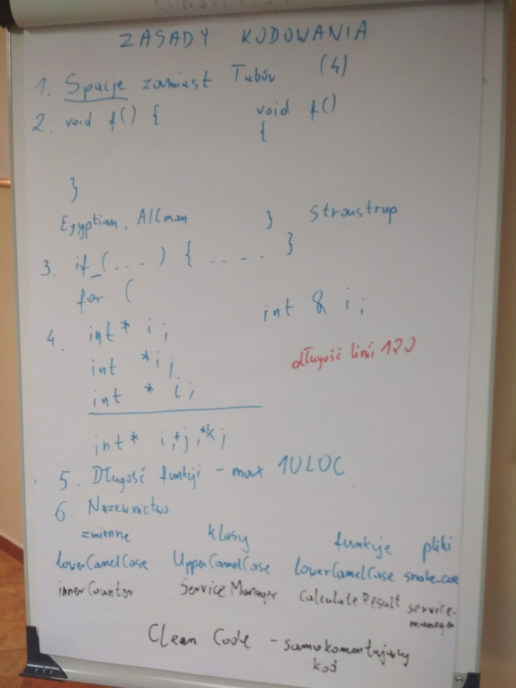
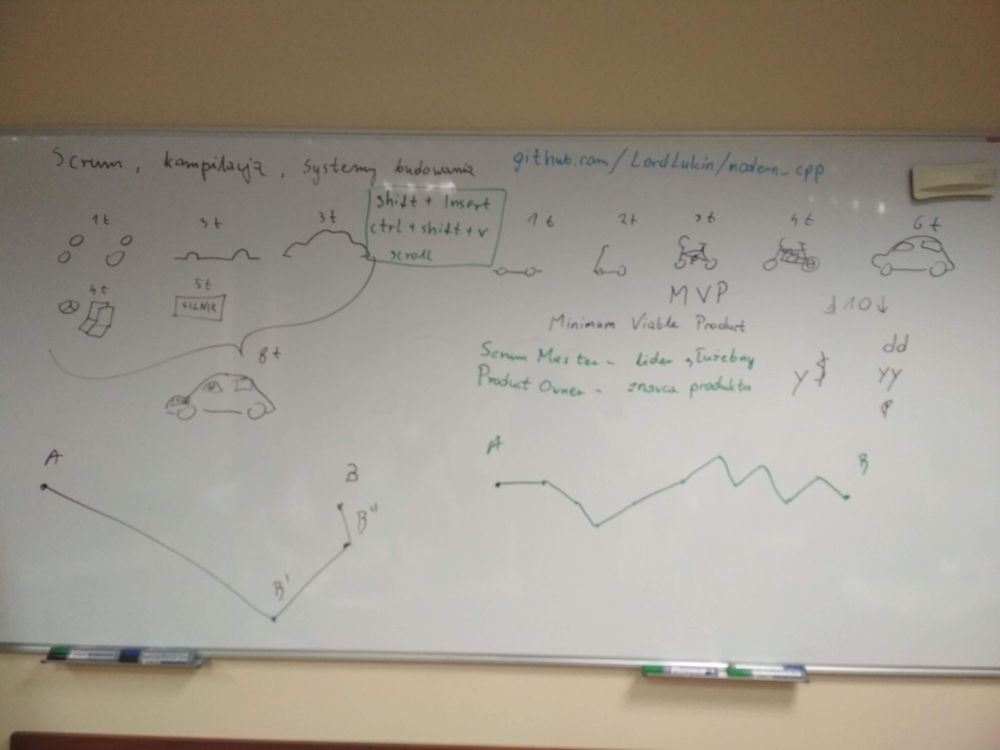
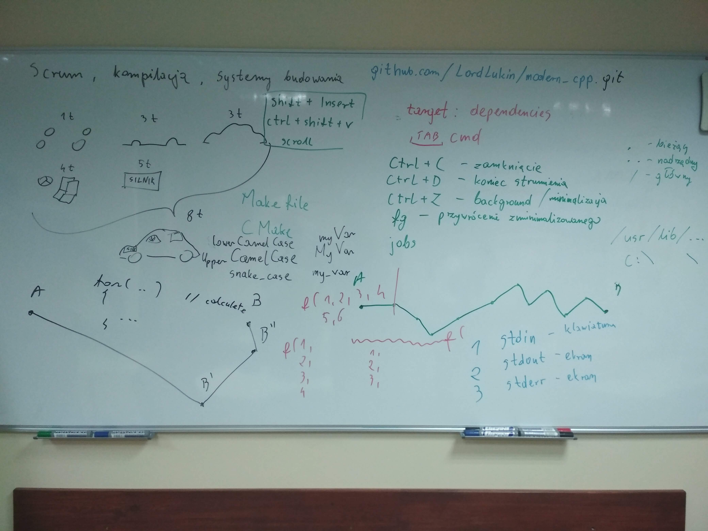

# Kurs-CPP
Materials from C++ Course at Coders School (January 2019 - March 2019)

## 14.01.2019 Narzędzia programisty (scrum, kompilacja, systemy budowania)

### Pre-work
- [X] Zapoznaj się pobieżnie ze [standardem kodowania Google](https://google.github.io/styleguide/cppguide.html) oraz [standardem kodowania LLVM](https://llvm.org/docs/CodingStandards.html). Możesz je porównać i wychwycić podobieństwa i różnice.
- [X] Poszukaj samemu informacji o tym, czym jest Makefile
- [X] Poszukaj samemu informacji o tym, czym jest Scrum
- [X] Koniecznie utwórz Pull Requesta (PR), aby powiadomić mnie o statusie Twojej pracy domowej, najlepiej gdy wykonasz wszystko. PR możesz potem aktualizować.

### Materials
- [Ściągawka - Niektóre opcje kompilacji](sciaga_opcje_kompilacji.pdf)
- [Ściągawka - Scrum](sciaga_scrum.pdf)
- [Scrum Framework](ScrumFramework.pdf)
- [Cmake documentation](https://cmake.org/cmake/help/v3.13/manual/cmake-commands.7.html)
- Foto z zajęć:
-  
   
- [Nagranie z zajęć](https://www.youtube.com/watch?v=sb5o5lmN-O0&feature=youtu.be)

### Post-work (deadline: 20.01.2019)
- [ ] Sforkuj [repozytorium modern_cpp](https://github.com/LordLukin/modern_cpp) (przycisk Fork na GitHub). Spowoduje to skopiowanie projektu na twoje konto GitHuba. Napisz poprawny Makefile do tego projektu, który wykorzystuje zmienne. Wkomituj go i udostępnij na GitHubie, zrób Pull Requesta. [Przydatny link](http://mrbook.org/blog/tutorials/make/). **[Poprawny Makefile](Makefile)**
- [ ] Posłuchaj [podcastu o Scrumie](http://mariuszchrapko.com/jak-scrum-wplywa-na-efektywnosci-zespolu/)
- [ ] Zrób [test Narzędzia programisty](https://goo.gl/forms/EQurphnqBaOG20U32)

### Pre-work for the next lesson (deadline 15.01.2019)
- [ ] Obejrzyj [wideo jak działa alokacja pamięci](https://www.youtube.com/watch?v=CSVRA4_xOkw)
- [ ] Obejrzyj [wideo o tym, jak działają wskaźniki](https://www.youtube.com/watch?v=W0aE-w61Cb8)
- [ ] Wpisz poniżej 3 rzeczy, które wg siebie najmniej rozumiesz w C++ i zrób Pull Request :)
  - __________
  - __________
  - __________

