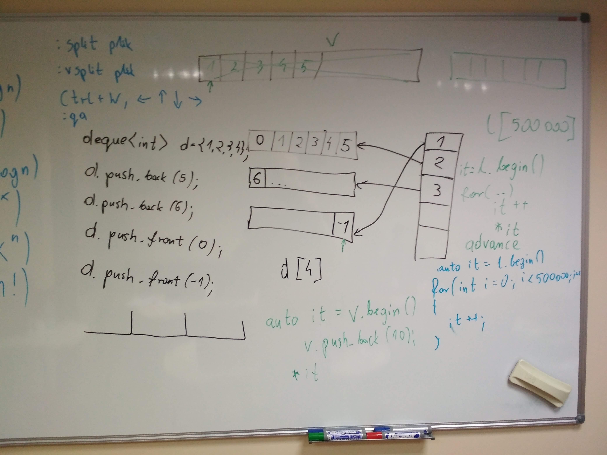
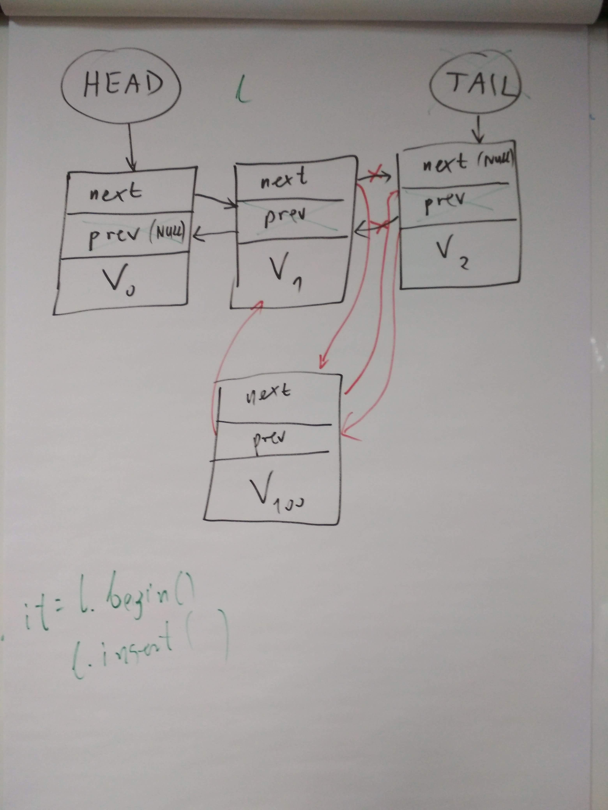
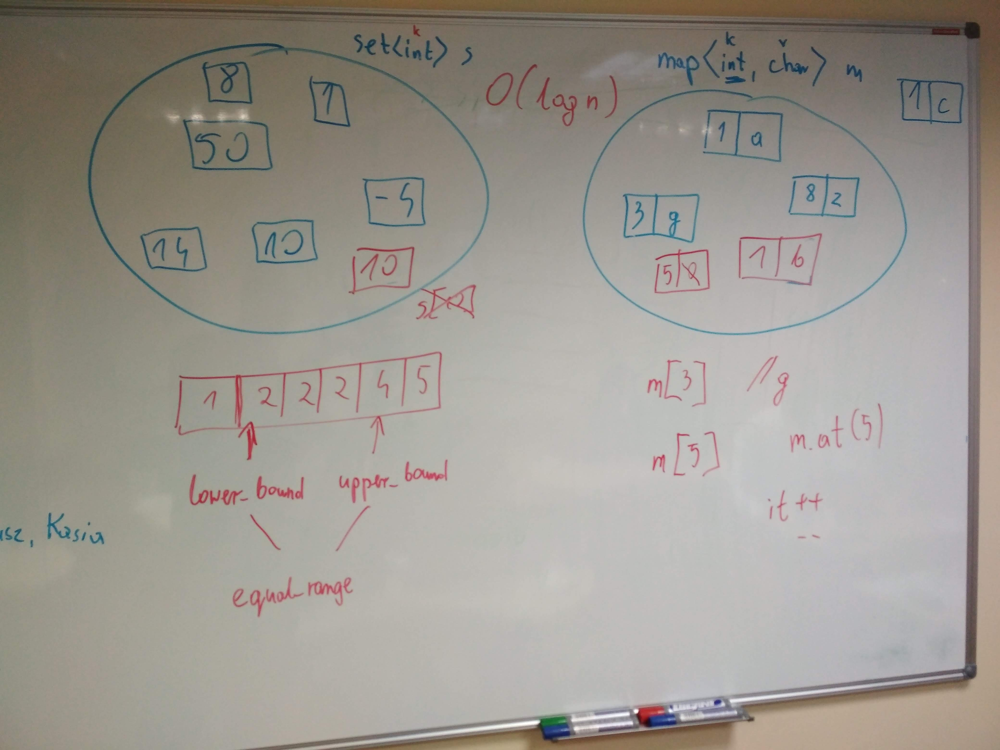
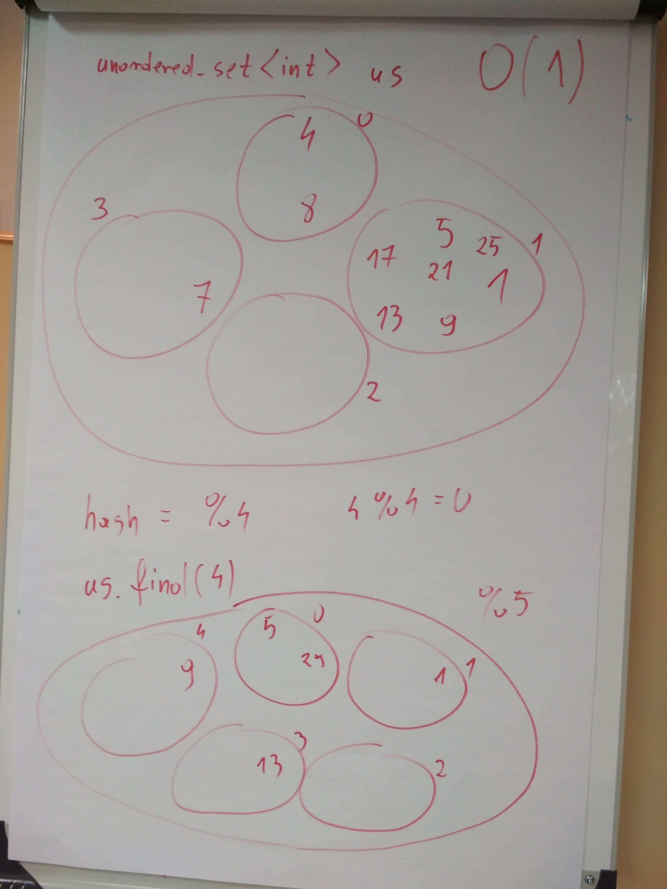
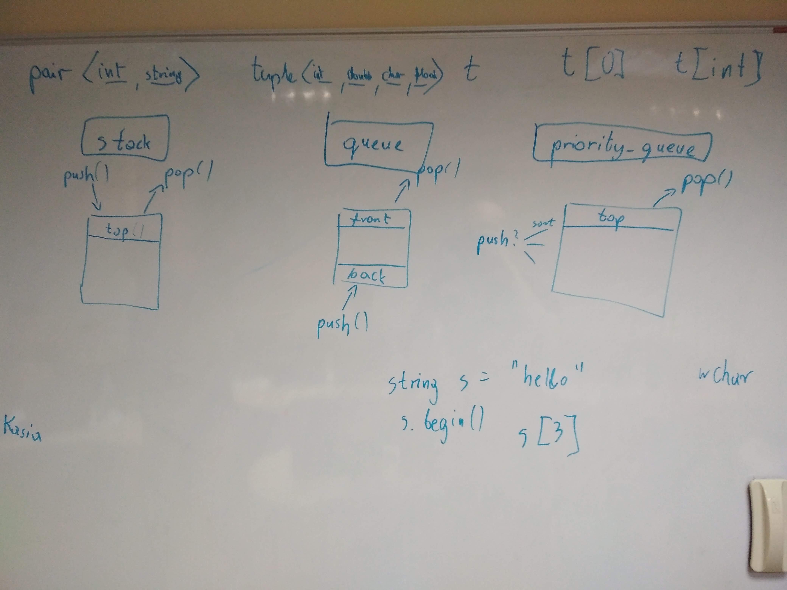
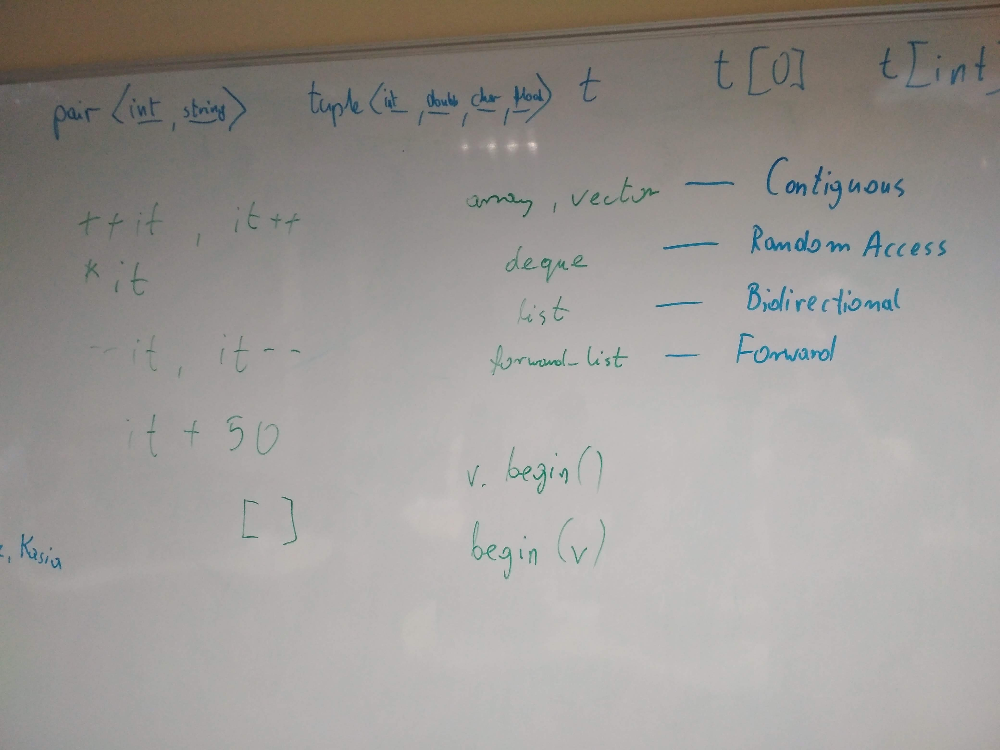
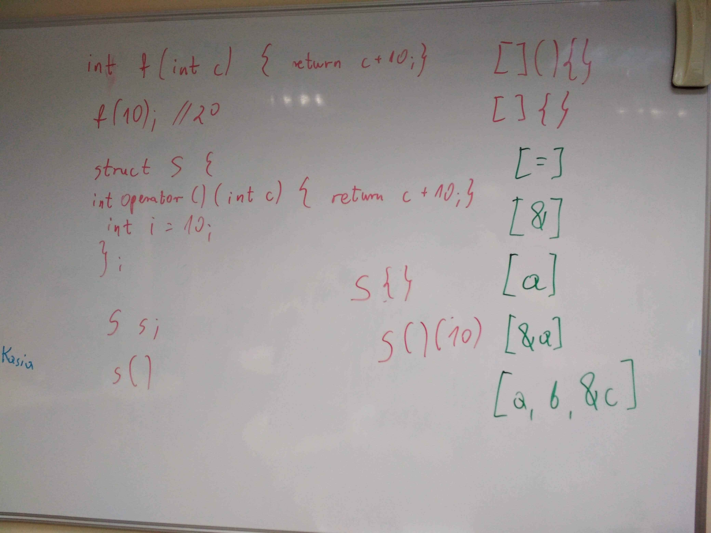
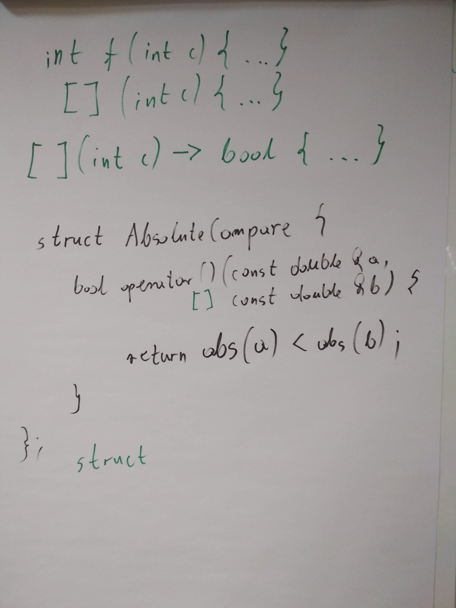

# Kurs-CPP
Materials from C++ Course at Coders School (January 2019 - March 2019)

## 22.01.2019 STL - kontenery, iteratory, funktory, lambdy

### Materials
- [Dokumentacja C++ (cppreference.com)](https://en.cppreference.com/)
- [Prezentacja z zajęć o STL](STL_full.pdf)
- [Zadania z STLa](zadania_STL.pdf)
- [Ściąga z funktorów i lambd](Funktory_i_lambdy.pdf)
- [Ściąga z iteratorów](iteratory.pdf)
- [C++ Data Structures and Algorithms Cheat Sheet](https://github.com/gibsjose/cpp-cheat-sheet/blob/master/Data%20Structures%20and%20Algorithms.md)
- [Rozwiązania zadań z listy](https://github.com/LordLukin/stl)

### Nagranie i foto
- [Nagranie z zajęć](https://www.youtube.com/watch?v=LuUH1noMi-0&feature=youtu.be)
-  
   
   
   

