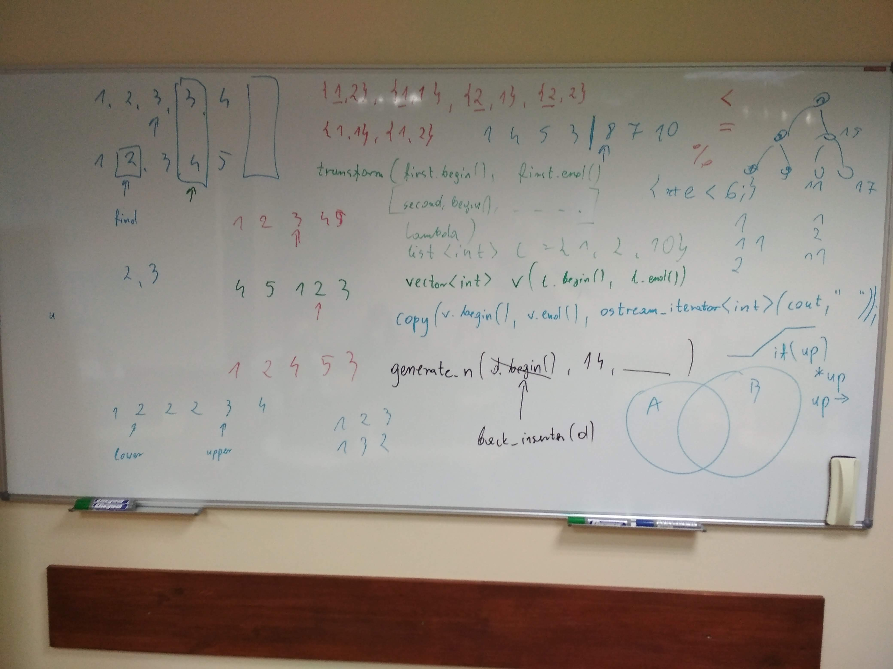
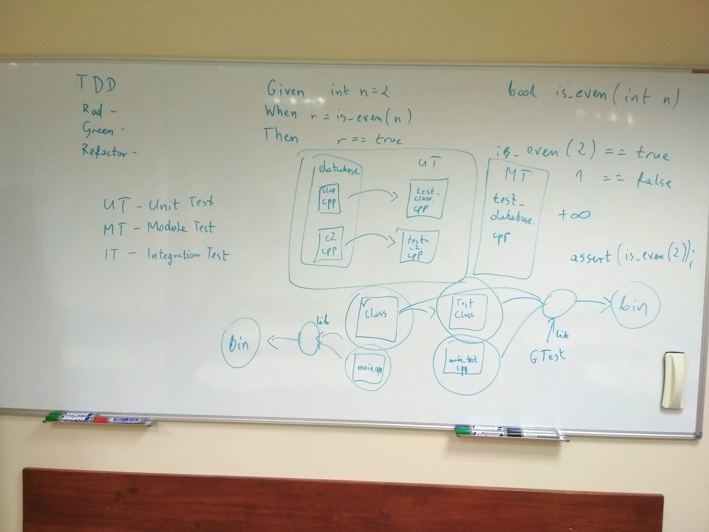

# Kurs-CPP
Materials from C++ Course at Coders School (January 2019 - March 2019)

## 04.02.2019 STL - algorytmy, wstęp do testowania

### Pre-work 
- [ ] Zapoznaj się ze [ściągawką o polimorfiźmie](polimorfizm.pdf). Przyda się to też w projekcie grupowym.

### Materials
- [Dokumentacja C++ (cppreference.com)](https://en.cppreference.com/)
- [Prezentacja z zajęć o STL](STL_full.pdf)
- [Zadania z STLa](zadania_STL.pdf)

### Nagranie i foto
- [Nagranie z zajęć](https://www.youtube.com/watch?v=CxJdYkyjXy0&feature=youtu.be)
-  
  

### Post-work
- [ ] Zrób test z STLa (w formie papierowej)
- [ ] Wyzwanie: Zrób zadanie 12A lub 12B (albo nawet oba). Wygrywa osoba, które użyje najmniej gołych pętli for/while/do-while
- [ ] Doszlifujcie projekt grupowy:
  - poprawcie znalezione Issues
  - dokończcie brakującą implementację
  - ujednolićcie formatowanie 
  - użyjcie STLa, gdzie się da
- [ ] Zrób ściągawkę na jeden z poniższych tematów do wyboru. Obowiązkowo daj w niej przykłady kodu:
  - stos i sterta
  - przekazywanie parametrów - kopia, wskaźnik, referencja
  - konwersje jawne i niejasne, operatory konwersji, konstruktory konwertujące, rodzaje konwersji (static, dynamic, const, reinterpret, C-style)
  - operatory (porównania, strumienia, arytmetyczne, ...)
  - słówka kluczowe - static, extern, inline, explicit, register, friend, volatile, virtual, mutable
  - wyjątki
  - **kontenery STL**
  - **algorytmy STL**
  - **funkcje, funktory, lambdy, iteratory**

  Wybrany temat **zaznacz pogrubieniem**
  Ściągę wrzuć na Discorda podziel się nią z grupą. Reszta grupy da komentarze, czy wszystko jest jasne czy nie.

### Pre-work for the next classes
- [ ] Obejrzyj [wideo Uncle Boba o TDD](https://trello-attachments.s3.amazonaws.com/5b20ebcd819b419f2d65c274/5b5d70bf109bc670f6d8d10d/90fb5c9305b6e8092df116da1c845210/fm_CleanCode-E6-P2-540p.mp4). Do zrozumienia punktacji gry w kręgle przydatny może być [ten opis zasad](bowling.txt)
- [ ] Poczytaj dokumentację frameworka do testowania [Catch2](https://github.com/catchorg/Catch2/blob/master/docs/tutorial.md)
- [ ] **Używając frameworka Catch2 napisz kilka testów do projektu z bazą danych studentów**
- [ ] Poczytaj dokumentację frameworka do testowania [GTest](https://github.com/google/googletest/blob/master/googletest/docs/primer.md)
- [ ] Obejrzyj [strukturę projektu oraz CMake do testów w GTest](https://github.com/LordLukin/CombinedNumber). 
- [ ] Zrób Pull Request w celu powiadomienia mnie o statusie :)

