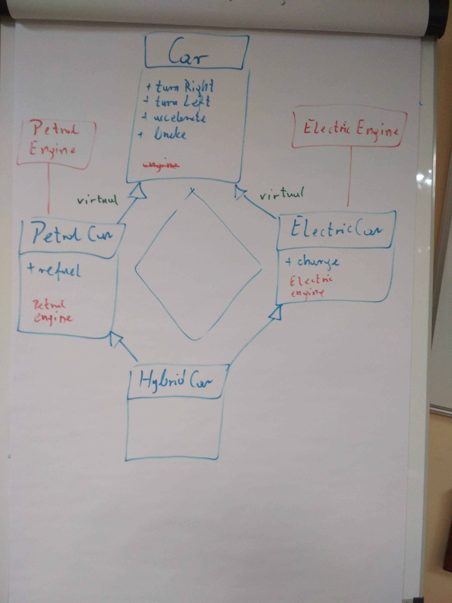

# Kurs-CPP
Materials from C++ Course at Coders School (January 2019 - March 2019)

## 05.02.2019 Obiektowy C++

### Materials
- [Prezentacja z zajęć o STL](ObiektowyC++.pdf)
- [Ściąga z polimorfizmu](polimorfizm.pdf)
- [Repozytorium z projektem](https://github.com/LordLukin/Cars)
- [Kolejność inicjalizacji](https://dorwijnerda.pl/blog/kolejnosc-inicjalizacji/)

### Nagranie i foto
- [Nagranie z zajęć](https://www.youtube.com/watch?v=3c7Dm_ZyRK8&feature=youtu.be)
-  
   
