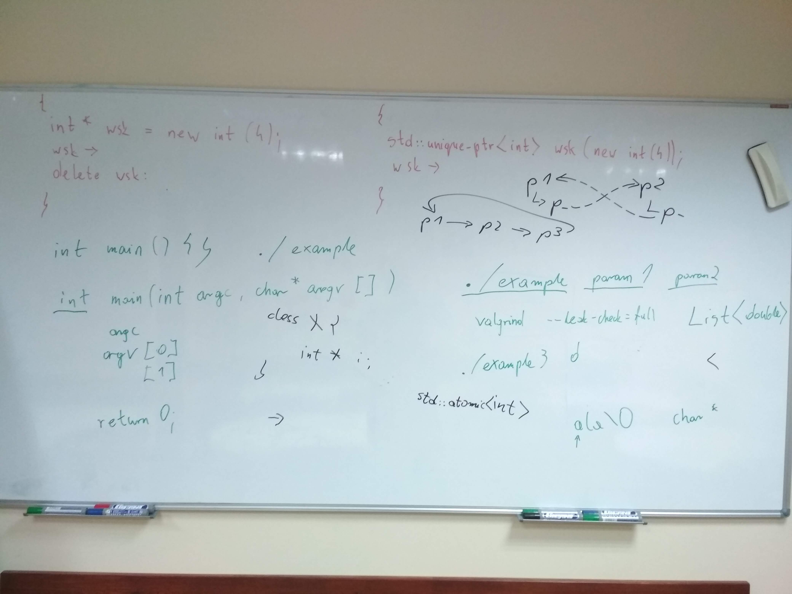

# Kurs-CPP
Materials from C++ Course at Coders School (January 2019 - March 2019)

## 12.02.2019 Zarządzanie pamięcią

### Pre-work 

### Materials
- [ ] Repo [memory management](https://github.com/LordLukin/memory_management)
- [ ] Framework [GTest](https://github.com/google/googletest/blob/master/googletest/docs/primer.md)
- [ ] [prezentacja Memory Management](memory_management.pdf)

### Nagranie i foto
- [Nagranie z zajęć](https://www.youtube.com/watch?v=OJCKdOFSRm0&feature=youtu.be)
-  

### Post-work
- [ ] Pozostałe zadania z repo [memory management](https://github.com/LordLukin/memory_management)
- [ ] Sprawdź wszystkie dotychczasowe programy, które napisaliśmy pod kątem wycieków pamięci. Jeśli takie są to popraw je używając inteligentnych wskaźników
- [ ] Napisz mi maila na lukasz@coders.school z odpowiedziami na poniższe pytania:
  1. Kiedy używamy operatora delete a kiedy delete[]? Podaj przykłady kodu.
  1. Co to jest RAII?
  1. Wymień znane Ci inteligentne wskaźniki (smart pointers) z biblioteki standardowej.
  1. Kiedy używać get(), release(), reset() na inteligentnych wskaźnikach?

### Pre-work for the next classes
- [ ] Poczytaj o nowościach, które weszły w [standardzie C++11](https://en.wikipedia.org/wiki/C%2B%2B11) oraz [standardzie C++14](https://en.wikipedia.org/wiki/C%2B%2B14)

