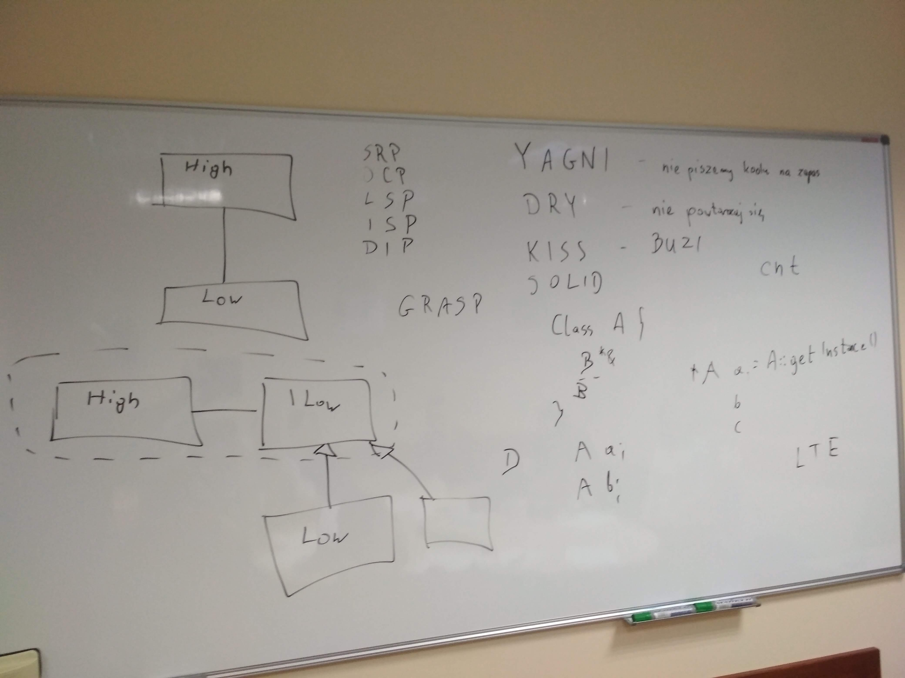

# Kurs-CPP
Materials from C++ Course at Coders School (January 2019 - March 2019)

## 05.03.2019 Dobre praktyki programistyczne

### Pre-work
- [ ] Przeczytaj artykuł o [SOLID](https://www.samouczekprogramisty.pl/solid-czyli-dobre-praktyki-w-programowaniu-obiektowym/)
- [ ] Przeczytaj artykuł o [KISS, DRY, YAGNI](https://www.samouczekprogramisty.pl/jakosc-kodu-a-oschle-pocalunki-jagny/)
- [ ] Przeczytaj opis algorytmu [Soundex](https://pl.wikipedia.org/wiki/Soundex). Będziemy go implementować na kolejnych zajęciach :)
- [ ] Poczytaj o wzorcach projektowych na stronie [Sourcemaking.com](https://sourcemaking.com/design_patterns)
  Dla ułatwienia najważniejsze wzorce masz na poniższej liście. Będzie fajnie jeśli je przerobisz, a jeszcze fajniej jak zapoznasz się ze wszystkimi.
  - Factory Method
  - Abstract Factory
  - Builder
  - Singleton
  - Adapter
  - Composite
  - Decorator
  - Facade
  - Observer
  - State
  - Strategy
  - Template Method
  - Visitor

### Materials
- [ ] Repo [Soundex](https://github.com/LordLukin/Soundex)
- [ ] [prezentacja From STUPID to SOLID code](From_STUPID_to_SOLID_code.pdf)

### Nagranie i foto
- [Nagranie z zajęć](https://www.youtube.com/watch?v=YhnUQreKy1A)
- 

### Post-work
- [ ] Projekt grupowy [Logical Images](https://github.com/LordLukin/LogicalImages) lub [Bowling](https://github.com/LordLukin/Bowling)
- [ ] [Post-test z Nowoczesnego C++](https://goo.gl/forms/4GTHOv9V6LecWA5C2) - masz wiele podejść, nie dowiem się kto tak słabo ten test wypełnia :D
- [ ] Zobacz na kod [PizzaOrders](https://github.com/LordLukin/PizzaOrders). Zbuduj go i uruchom program oraz testy. Spędź z tym kodem ok. godziny czasu, próbując zrozumieć co jego poszczególne części robią. **Wypisz sobie, co w tym kodzie wymaga poprawy według dobrych praktyk programistycznych**. Wskazówki znajdziesz:
  - w opisie w README.md
  - przeglądając historię commitów
  - patrząc na inne branche, na których są próby refaktoringu tego kodu przez zaawansowane grupy (ze szkoleń dla firm)

### Pre-work for the next classes
- [ ] Przygotuj krótkie wystąpienie (max 10 minut) o wybranym wzorcu projektowym. Forma dowolna (PowerPoint, tablica, wydruki, film? :D). Musi być przykład kodu w C++. Materiałami musisz podzielić się jakoś z innymi, aby mogli się oni nauczyć tego wzorca. Najlepiej gdy wrzucisz je jeszcze przed przyszłymi zajęciami na Discorda.
  - Factory Method (Przemek)
  - Abstract Factory (Michał)
  - Builder (Maja)
  - Singleton (Kasia)
  - Adapter
  - Composite (Marcin)
  - Decorator (Martyna)
  - Facade
  - Observer
  - State
  - Strategy (Jakub)
  - Template Method
  - Visitor
- [ ] Przygotuj krótkie wystąpienie (max 10 minut) na wybrany temat. Również dowolna forma. Podziel się materiałami. Obowiązkowo przykłady kodu/komendy/fragmenty plików.
  - git (Kasia)
  - systemy budowania
  - zarządzanie pamięcią (smart pointery, wycieki pamięci) (Tomek)
  - obiektowość w C++ (abstrakcja, enkapsulacja, dziedziczenie, polimorfizm, problem diamentowy)
  - testowanie kodu (Martyna)
  - wyjątki (Jakub)
  - lambdy, funktory, funkcje (Michał)
  - nowoczesny C++
  - kontenery STL (Maja)
  - algorytmy numeryczne
  - przekazywanie parametrów (kopia, wskaźnik, referencja) (Przemek)
  - kilka słów kluczowych C++ (wszystkich nie zdążymy ;)) (Marcin)
  - zasady SOLID

